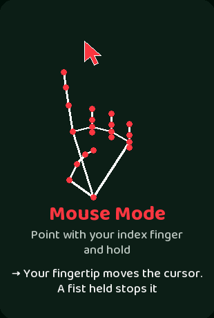
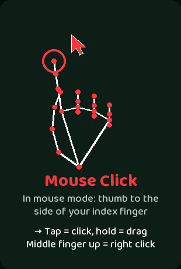

<p align="center">
  
</p>

<p align="center">
  <b>Control your Windows PC with your hands and your voice.</b><br>
  Swipe between apps, scroll, open Task View, minimize windows, and say what you want to open, all through your webcam and microphone.
</p>

---

## <a name="what-it-does"></a>

- **Tracks your hands** with your webcam and recognizes 15 gestures, from swipes and pushes to single-finger signs.
- **Controls Windows**: switch apps, open Task View, minimize or close the window in front, scroll, press Esc or Enter.
- **Understands your voice**: make the Search sign and say *"open Spotify"*, *"play lo-fi music on YouTube"* or *"google weather in London"*.
- **Runs offline**: hand tracking and speech recognition both run on your PC. Nothing you say or show is uploaded.
- **Explains itself**: make the Help sign with both hands to open a window with every gesture, a picture and a description.

## <a name="contents"></a>

[Quick start](#quick-start) · [Gestures](#gestures) · [Voice commands](#voice-commands) · [Air mouse](#air-mouse) · [Keys](#keys) · [Tips](#tips-for-best-results) · [Troubleshooting](#troubleshooting) · [How it works](#how-it-works) · [Project structure](#project-structure) · [Tuning](#tuning)

## <a name="quick-start"></a>

**You need:** Windows 10/11, Python 3, a webcam and a microphone. An NVIDIA GPU makes voice recognition fast (see [voice commands](#voice-commands)).

```bash
pip install opencv-python mediapipe pillow numpy faster-whisper
python src/camera.py
```

On the first run the app downloads two models:

| Model | Size | Used for |
|---|---|---|
| Google MediaPipe hand model | about 8 MB, saved in `src/` | tracking your hands |
| Whisper `large-v3` | about 3 GB, saved in your Hugging Face cache (not in this repo) | voice commands |

Your camera window opens mirrored, with your hand drawn as a skeleton and the name of the current gesture at the bottom. Try the **Help** sign (thumb, index and pinky up on both hands) to see everything the app can do.

## <a name="gestures"></a>

Hold the sign steady for a moment. The app waits about a third of a second after a hand appears before it acts, so raising your hands doesn't trigger anything by accident.

<table>
  <tr>
    <td align="center"></td>
    <td align="center"></td>
    <td align="center"></td>
  </tr>
  <tr>
    <td align="center"></td>
    <td align="center"></td>
    <td align="center"></td>
  </tr>
  <tr>
    <td align="center"></td>
    <td align="center"></td>
    <td align="center"></td>
  </tr>
  <tr>
    <td align="center"></td>
    <td align="center"></td>
    <td align="center"></td>
  </tr>
  <tr>
    <td align="center"></td>
    <td align="center"></td>
    <td align="center"></td>
  </tr>
</table>

| Gesture | How to make it | What it does |
|---|---|---|
| **Open Palm** | Palm to the camera, fingers spread | Shows the label only |
| **Double Open Palm** | Both palms to the camera | Shows the label only |
| **Swipe** | Open hand moved sideways (or a quick slap) | Left to right: next app (Alt+Tab). Right to left: previous app. In Task View: moves the selection |
| **Search** | Thumb and index fingertip touch in a circle | Starts listening for a [voice command](#voice-commands) |
| **Middle Finger** | Only the middle finger up | Shows a rude reply |
| **Help** | Thumb, index and pinky up on both hands | Opens the Help window with all gestures |
| **Fist** | Hold a closed fist | Opens Task View (Win+Tab) |
| **Push** | Open hands toward the camera | One hand minimizes the window in front, two hands close it. In Task View: cancels (Esc) |
| **Pull** | Open hand back away from the camera | In Task View: opens the selected window (Enter) |
| **Scroll Up** | Thumb and index out in an "L", other fingers curled | Slowly scrolls the window in front up while you hold it |
| **Scroll Down** | Index and middle finger up, ring and pinky curled | Slowly scrolls the window in front down while you hold it |
| **Escape** | Only the pinky up, other fingers curled | Presses the Esc key (skipped while the Camera window is in front, since Esc would quit the app) |
| **Enter** | Ring and pinky up, index and middle curled | Presses the Enter key |
| **Mouse Mode** | Point with your index finger only (thumb tucked in) and hold | Starts the [air mouse](#air-mouse): your fingertip moves the cursor. A held fist stops it |
| **Mouse Click** | In mouse mode: thumb to the side of your index finger | Tap = click, hold = drag. Middle finger up = right click |

> **Careful with Push:** a two-hand push asks the window in front to close, like clicking its X. Programs with unsaved work will still ask you to save first.

A typical flow: **Fist** to open Task View, **Swipe** to pick a window, **Pull** to open it (or **Push** to cancel).

The Help window (make the Help sign to open it) looks like this:

<p align="center">
  
</p>

## <a name="voice-commands"></a>

Make the **Search** sign, say something, then pause. The camera window shows "Listening...", then "Thinking...", then what the app did.

| You say | What happens |
|---|---|
| "YouTube", "open Reddit", "go to GitHub", "youtube.com" | Opens the site in **Opera** |
| "play lo-fi music on YouTube", "watch cat videos", "YT daft punk" | Finds the top YouTube result and opens that **video** in Opera |
| "search YouTube for lo-fi music", "search cats on YouTube" | Opens the search results (not a video) in Opera |
| "google weather in London" | Google search in Opera |
| "open Spotify", "launch Discord", "open calculator" | Starts that installed app |
| anything else, like "weather in London" | Opens Windows Search and types it for you. Make the **Enter** sign to run it |

- **Sites** open in Opera. If Opera isn't installed, they open in your default browser. More sites can be added to `SITES` in `src/commands.py`.
- **Apps** are found by name from your Start menu, and close matches work ("chrome" finds "Google Chrome"). It also knows Notepad, Paint and a few other built-in tools.
- **Speech recognition** is [Whisper](https://github.com/SYSTRAN/faster-whisper) `large-v3`, English only, running **on your PC**. On an NVIDIA GPU with about 4 GB of free memory a phrase takes about a second. Without a GPU it falls back to the CPU, which works but is much slower.
- **Privacy:** your voice never leaves your PC. The one online request is finding the top video for "play ... on YouTube", and it only sends the search words.
- **Bare "play" or "watch"** is treated as a YouTube video.

## <a name="air-mouse"></a>

Use your hand as a mouse:

1. **Start:** point with your index finger only (thumb tucked in, other fingers curled) and hold for about a second. The camera window shows "Mouse mode on".
2. **Move:** your index fingertip moves the cursor. A thin white rectangle in the camera window shows the part of the picture that covers the whole screen, so you can reach every edge. The cursor is smoothed, steady when you move slowly and quick when you move fast.
3. **Click and drag:** touch the side of your index finger with your thumb. A quick tap is a click. Keep the thumb pressed while you move to drag.
4. **Right click:** raise your middle finger for a moment. The cursor stays put while you do it.
5. **Stop:** make a fist and hold. It also stops by itself if your hand is out of view for 6 seconds.

While mouse mode is on, all the other gestures are switched off, so a swipe or push can't fire by accident. Esc or q in the camera window still quits the app.
## <a name="keys"></a>

| Key | Action |
|---|---|
| **Esc** or **q** | Quit the app (closing the camera window with the X also quits) |
| **h** | Close the Help window |
| Mouse wheel, arrow keys, **W** / **S** | Scroll the Help window |

## <a name="tips-for-best-results"></a>

- Use **good, even lighting** and keep your hand in front of a plain background if you can.
- Keep your hand **about an arm's length** from the camera so all your fingers are visible.
- **Hold each sign steady** for about half a second. Signs like Escape, Enter, Fist and the scroll signs need a short hold.
- For **Push and Pull**, move your open hand straight toward or away from the camera without moving it sideways or up and down.
- For **voice commands**, speak clearly, then pause for a second. Background noise can make it wait longer.

## <a name="troubleshooting"></a>

| Problem | Fix |
|---|---|
| `cv2.imshow` says the function is not implemented | You have `opencv-python-headless` installed too. Uninstall both and reinstall only `opencv-python` |
| Voice commands hear nothing | Check that your microphone isn't muted (Settings > System > Sound > Input, or your laptop's mic mute key) and that Windows allows apps to use it (Settings > Privacy & security > Microphone) |
| "Could not open camera" | Close other apps using the camera, or check that the camera isn't switched off |
| Voice is slow | Without an NVIDIA GPU the speech model runs on the CPU. That works but takes much longer |
| A gesture triggers by accident or doesn't trigger | See [Tuning](#tuning) |

## <a name="how-it-works"></a>

1. **Hand tracking:** OpenCV reads the camera and [MediaPipe](https://developers.google.com/mediapipe) finds 21 landmarks on each hand.
2. **Gesture rules:** simple geometry on those landmarks (which fingers are extended, how far apart they are, how the hand moves over time) decides which gesture you're making. There is no custom-trained model.
3. **Actions:** the app presses Windows shortcuts, scrolls the mouse wheel and controls windows through the Win32 API.
4. **Voice:** the Search sign records from your microphone, [faster-whisper](https://github.com/SYSTRAN/faster-whisper) turns it into text, and `commands.py` decides whether to open an app, open a site or type the words.

## <a name="project-structure"></a>

```
Gesture-App/
├── src/
│   ├── camera.py            camera loop, gesture detection and actions
│   ├── mouse.py             air mouse: cursor, clicks and drags from your hand
│   ├── voice.py             microphone listening and offline speech recognition
│   ├── commands.py          turns what you said into an action (app, site or typing)
│   ├── help_screen.py       draws the Help window
│   └── Baloo2.ttf             font for the on-screen text (Baloo 2, Google Fonts, SIL Open Font License)
├── tools/
│   └── make_readme_images.py  regenerates the images in docs/
└── docs/                    banner and gesture pictures used in this README
```

To regenerate the pictures after changing the Help window, run `python tools/make_readme_images.py`.

## <a name="tuning"></a>

Sensitivity is set by constants near the top of `src/camera.py`:

| Constant | Controls |
|---|---|
| `SWIPE_MIN_DX`, `SLAP_MIN_DX` | how far your hand must move for a swipe or slap |
| `PUSH_GROWTH` | how much bigger your hand must look for a push (and how much smaller for a pull) |
| `STABLE_S` | how long hands must be tracked steadily before swipes and pushes count |
| `FIST_HOLD_S`, `ESCAPE_HOLD_S`, `ENTER_HOLD_S` | how long a sign is held before it fires |
| `SCROLL_RATE` | scroll speed while a scroll sign is held |

## <a name="credits"></a>

Built with [OpenCV](https://opencv.org), [MediaPipe](https://developers.google.com/mediapipe), [faster-whisper](https://github.com/SYSTRAN/faster-whisper) (OpenAI Whisper), [Pillow](https://python-pillow.org) and the [Baloo 2](https://fonts.google.com/specimen/Baloo+2) font.

Made by [Izu83](https://github.com/Izu83).