<p align="center">
  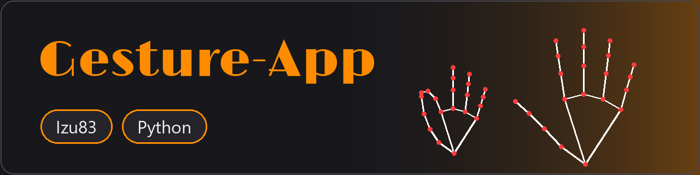
</p>

# Gesture-App

Control your Windows PC with hand gestures. The app watches your webcam, tracks your hands with
[MediaPipe](https://developers.google.com/mediapipe), and turns gestures into actions.

Windows only (it sends Windows keyboard shortcuts and controls windows).

## Setup

You need Python 3 and a webcam.

```bash
pip install opencv-python mediapipe pillow numpy faster-whisper
python src/camera.py
```

On the first run the app downloads Google's hand model (`hand_landmarker.task`, about 8 MB) into `src/`.

### Voice search

The Search gesture also listens to your microphone. Say your search, it stops when you pause, and
the text is typed into the Windows Search box. Then make the Enter sign to run it. Speech recognition
is [Whisper](https://github.com/SYSTRAN/faster-whisper) (`large-v3`), running **offline on your PC**:
nothing you say is uploaded. It is English only.

The first run downloads the model (about 3 GB, cached in your Hugging Face cache, not in this repo).
It runs on an NVIDIA GPU with about 4 GB free memory (a phrase takes about a second); without a GPU it
falls back to the CPU, which works but is much slower. The camera window shows "Listening...",
"Thinking..." and "Typed" while it works.
If you get an error about `cv2.imshow` not being implemented, you have `opencv-python-headless`
installed as well. Uninstall both and reinstall only `opencv-python`.

## Gestures

The camera window is mirrored and shows your hand skeleton. The name of the gesture appears at the bottom.

| Gesture | How to make it | What it does |
|---|---|---|
| Open Palm | Palm to the camera, fingers spread | Shows the label only |
| Double Open Palm | Both palms to the camera | Shows the label only |
| Swipe | Open hand moved sideways (or a quick slap) | Left to right: next app (Alt+Tab). Right to left: previous app. In Task View: moves the selection |
| Search | Thumb and index fingertip touch in a circle | Opens Windows Search (Win+S) and listens to your microphone: say what you want, it is typed for you, then make the Enter sign |
| Middle Finger | Only the middle finger up | Shows a rude reply |
| Help | Thumb, index and pinky up on both hands | Opens the Help window with all gestures |
| Fist | Hold a closed fist | Opens Task View (Win+Tab) |
| Push | Open hands toward the camera | One hand minimizes the window in front, two hands close it. In Task View: cancels (Esc) |
| Pull | Open hand back away from the camera | In Task View: opens the selected window (Enter) |
| Scroll Up | Thumb and index out in an "L", other fingers curled | Slowly scrolls the window in front up while you hold it |
| Scroll Down | Index and middle finger up, ring and pinky curled | Slowly scrolls the window in front down while you hold it |
| Escape | Only the pinky up, other fingers curled | Presses the Esc key (skipped while the Camera window is in front, since Esc would quit the app) |
| Enter | Ring and pinky up, index and middle curled | Presses the Enter key |

Two-hand push asks the program to close, so programs with unsaved work will still ask you to save.

### At a glance

<table>
  <tr>
    <td align="center">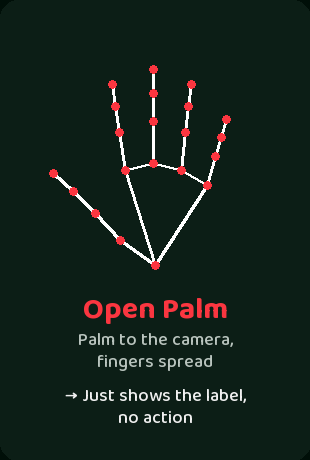</td>
    <td align="center">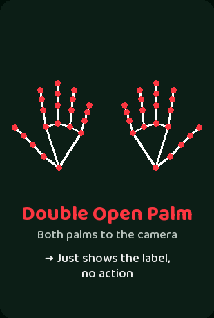</td>
    <td align="center">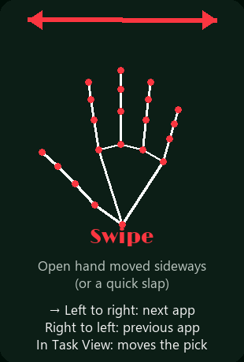</td>
  </tr>
  <tr>
    <td align="center">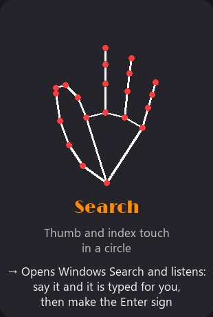</td>
    <td align="center">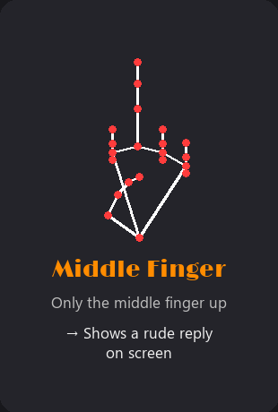</td>
    <td align="center">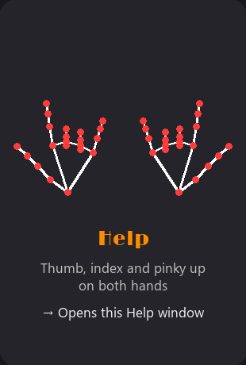</td>
  </tr>
  <tr>
    <td align="center">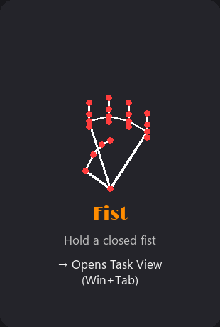</td>
    <td align="center">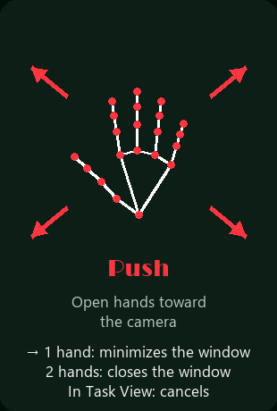</td>
    <td align="center">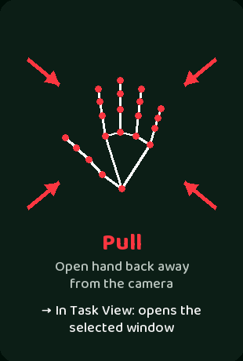</td>
  </tr>
  <tr>
    <td align="center">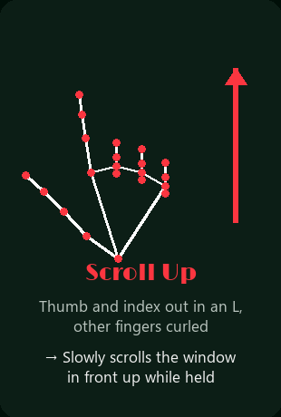</td>
    <td align="center">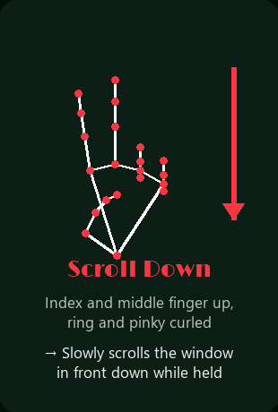</td>
    <td align="center">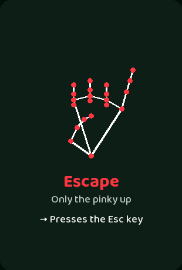</td>
  </tr>
  <tr>
    <td></td>
    <td align="center">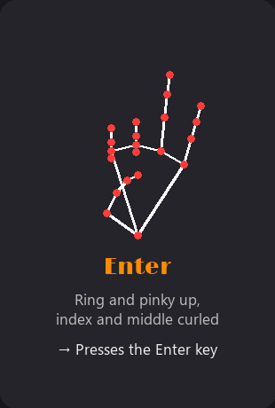</td>
    <td></td>
  </tr>
</table>

The pictures are the same ones shown in the app's Help window (make the Help sign to open it):

<p align="center">
  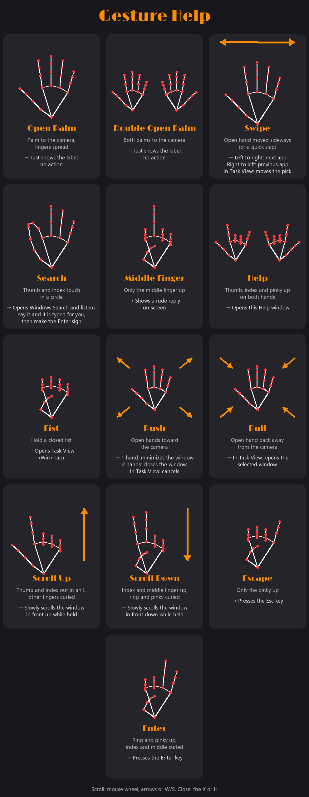
</p>

## Keys

- **Esc** or **q**: quit the app (closing the camera window with the X also quits)
- **h**: close the Help window
- In the Help window: mouse wheel, arrow keys or **W** / **S** to scroll

## Files

- `src/camera.py`: camera loop, gesture detection and actions
- `src/voice.py`: microphone listening, offline speech recognition and typing the text
- `src/help_screen.py`: draws the Help window
- `tools/make_readme_images.py`: regenerates the images in `docs/` (`python tools/make_readme_images.py`)
- `src/Limelight-Regular.ttf`: font used for the on-screen text (Google Fonts, SIL Open Font License)

## Tuning

Gesture sensitivity is set by constants near the top of `src/camera.py`, for example
`SWIPE_MIN_DX`, `PUSH_GROWTH`, `STABLE_S` and `FIST_HOLD_S`.